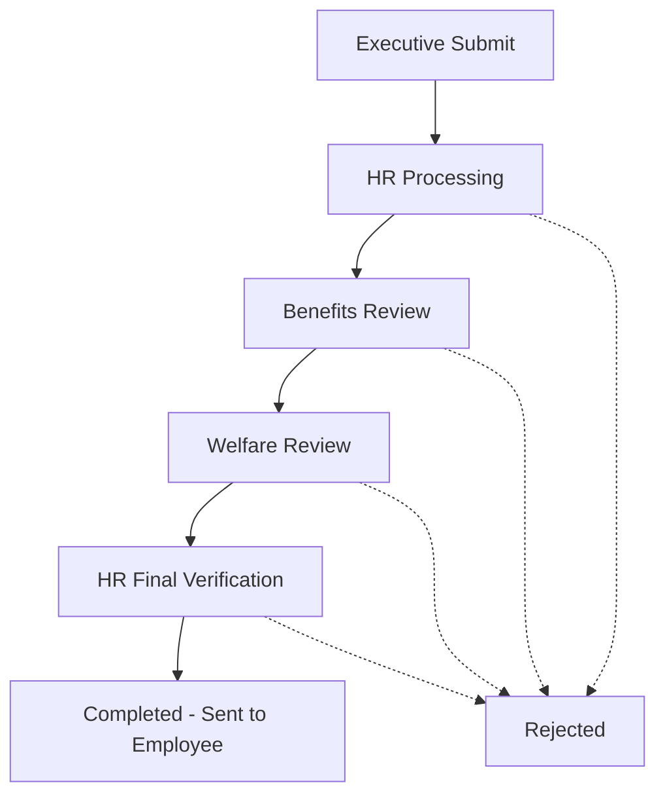

# MetroExecuCare Enhanced Workflow Documentation
## HR Final Document Verification System

### Overview
This document outlines the enhanced 5-stage workflow system implemented in MetroExecuCare, which includes a new HR Final Document Verification stage after welfare approval. This ensures quality control and proper document management before final delivery to employees.

---

## Table of Contents
1. [Workflow Stages](#workflow-stages)
2. [Database Schema Changes](#database-schema-changes)
3. [Backend Implementation](#backend-implementation)
4. [File Management System](#file-management-system)
5. [Email Notifications](#email-notifications)
6. [User Permissions](#user-permissions)
7. [API Endpoints](#api-endpoints)
8. [Frontend Integration](#frontend-integration)
9. [Testing Guide](#testing-guide)
10. [Troubleshooting](#troubleshooting)

---

## Workflow Stages

### Complete 5-Stage Process

| Stage | Role | Status | Description | Actions Available | Next Stage |
|-------|------|--------|-------------|-------------------|------------|
| **1** | Executive | `pending` | Employee submits checkup request | • Upload supporting documents<br>• Submit request | `hr_processing` |
| **2** | HR Personnel | `hr_processing` | Initial processing and hospital assignment | • Review request<br>• Assign hospital<br>• Upload HR documents<br>• Process request | `benefits_review` |
| **3** | Benefits Officer | `benefits_review` | Benefits review and validation | • Review request<br>• Upload benefits documents<br>• Approve/Reject | `welfare_review` |
| **4** | Welfare Head | `welfare_review` | Final policy approval | • Review all documents<br>• Upload welfare documents<br>• Approve/Reject | `hr_final_verification` |
| **5** | HR Personnel | `hr_final_verification` | **NEW:** Final document verification | • Review all documents<br>• Add/Delete files<br>• Verify completeness<br>• Send to employee | `completed` |

### Stage Transitions



---

## Database Schema Changes

### New Approval Stage Added

#### `request_approvals` Table
```sql
-- New stage added to approval workflow
INSERT INTO request_approvals (
    request_id, approval_stage, required_role, approval_order,
    action, is_current_stage, created_at
) VALUES (
    ?, 'hr_final_stage', 'hr_personnel', 4,
    'pending', FALSE, NOW()
);
```

#### Updated Status Values
- **Added:** `hr_final_verification` - New status after welfare approval
- **Changed:** Final status is now `completed` instead of `approved`

#### Stage Mapping
```javascript
const stageMapping = {
    'benefits_review': 'benefits_stage',
    'welfare_review': 'welfare_stage',
    'hr_final_verification': 'hr_final_stage'  // NEW
};
```

---

## Backend Implementation

### File Locations Modified

#### 1. Request Controller (`requestController.js`)
**Changes Made:**
- Updated approval stages array to include HR final stage
- Modified file upload permissions for final verification

```javascript
// NEW: Added 4th stage to initial approval creation
const approvalStages = [
    { stage: 'hr_stage', role: 'hr_personnel', order: 1 },
    { stage: 'benefits_stage', role: 'benefits_officer', order: 2 },
    { stage: 'welfare_stage', role: 'welfare_head', order: 3 },
    { stage: 'hr_final_stage', role: 'hr_personnel', order: 4 }  // NEW
];
```

#### 2. Request Workflow Controller (`requestWorkflowController.js`)
**Major Changes:**

##### A. Welfare Approval Logic
```javascript
// OLD: Welfare approval went directly to 'approved'
} else if (request.current_status === 'welfare_review' && userRole === 'welfare_head') {
    currentStage = 'welfare_stage';
    nextStatus = 'approved';  // OLD

// NEW: Welfare approval goes to HR final verification
} else if (request.current_status === 'welfare_review' && userRole === 'welfare_head') {
    currentStage = 'welfare_stage';
    nextStatus = 'hr_final_verification';  // NEW
```

##### B. HR Final Verification Logic
```javascript
// NEW: HR final verification completion
} else if (request.current_status === 'hr_final_verification' && userRole === 'hr_personnel' && request.assigned_hr_id === userId) {
    currentStage = 'hr_final_stage';
    nextStatus = 'completed';  // Final completion with document sending
```

##### C. Updated Stage Names
```javascript
const stageNames = {
    'hr_stage': 'HR',
    'benefits_stage': 'Benefits Officer',
    'welfare_stage': 'Welfare Head',
    'hr_final_stage': 'HR Final Verification'  // NEW
};
```

##### D. Enhanced Response Messages
```javascript
res.json({
    success: true,
    message: nextStatus === 'completed' && currentStage === 'hr_final_stage'
        ? 'Final document verification completed. All documents have been sent to the employee.'
        : `Request approved at ${stageNames[currentStage]} stage`,
    data: {
        current_status: nextStatus,
        is_final_approval: nextStatus === 'completed',  // Changed from 'approved'
        is_hr_final_verification: nextStatus === 'hr_final_verification'  // NEW
    }
});
```

---

## File Management System

### File Upload Permissions by Stage

| Role | Allowed Stages | Conditions |
|------|----------------|------------|
| **Executive** | Any | Own requests only (`request.employee_id === userId`) |
| **HR Personnel** | `hr_processing`, `hr_final_verification` | Assigned requests only (`request.assigned_hr_id === userId`) |
| **Benefits Officer** | `benefits_review`, `welfare_review` | Status-based permissions |
| **Welfare Head** | `welfare_review` | Status-based permissions |
| **Admin** | Any | No restrictions |

### Updated Permission Logic
```javascript
// Backend file upload permissions (requestController.js)
if (userRole === 'executive' && request.employee_id === userId) {
    hasPermission = true;
} else if (userRole === 'hr_personnel' && request.assigned_hr_id === userId) {
    // HR can upload during initial processing AND final verification
    hasPermission = true;
} else if (userRole === 'benefits_officer' && ['benefits_review', 'welfare_review'].includes(request.current_status)) {
    hasPermission = true;
} else if (userRole === 'welfare_head' && request.current_status === 'welfare_review') {
    hasPermission = true;
}
```

### File Operations Available by Role

#### HR Personnel (Final Verification Stage)
- ✅ **Upload new files** (missing documents, corrections)
- ✅ **Delete existing files** (incorrect or outdated documents)
- ✅ **Download all files** (from all previous stages)
- ✅ **View file history** (who uploaded what and when)

#### Other Roles (Previous Stages)
- ✅ **Upload files** (stage-specific documents)
- ✅ **Download files** (view previous uploads)
- ❌ **Delete files** (only HR in final verification can delete)

---

## Email Notifications

### Enhanced Email Flow

#### 1. Welfare Approval → HR Final Verification
**Trigger:** Welfare Head approves request
**Recipient:** Assigned HR Personnel
**Template:** Task Notification

```javascript
// Email sent when welfare approves
emailService.sendTaskNotification(
    hrUser,
    `Final Document Verification Required`,
    `Request ${requestData.request_number} has been approved by Welfare Head. Please verify all documents and send final approval to employee.`,
    approver
);
```

#### 2. HR Final Verification → Employee Completion
**Trigger:** HR Personnel completes final verification
**Recipient:** Employee (Executive)
**Template:** Final Completion Notification

```javascript
// Email sent when HR completes final verification
emailService.sendFinalCompletionNotification(
    requestData,
    executive,
    approver
);
```

### Email Templates Required

#### New Email Template: `sendFinalCompletionNotification`
**Purpose:** Send all final documents to employee
**Attachments:** All approved documents from all stages
**Content:**
- Request approval confirmation
- Hospital assignment details
- Complete document package
- Next steps for employee

---

## User Permissions

### Role-Based Access Control

#### HR Personnel
**During Initial Processing (`hr_processing`):**
- Process requests assigned to them
- Upload HR-specific documents
- Assign hospitals
- Move to benefits review

**During Final Verification (`hr_final_verification`):**
- Review all documents from all stages
- Upload additional documents if needed
- Delete incorrect or outdated documents
- Send final package to employee
- Complete the entire process

#### Benefits Officer
**During Benefits Review (`benefits_review`):**
- Review HR-processed requests
- Upload benefits-related documents
- Approve/reject requests
- Move to welfare review

#### Welfare Head
**During Welfare Review (`welfare_review`):**
- Review benefits-approved requests
- Upload welfare-related documents
- Approve/reject requests
- Move to HR final verification (instead of completion)

#### Executive
**During Any Stage:**
- View own request status
- Download documents
- Receive email notifications

---

## API Endpoints

### Modified Endpoints

#### 1. `POST /api/requests/:id/approve`
**Enhanced Response:**
```json
{
    "success": true,
    "message": "Request approved at Welfare Head stage",
    "data": {
        "current_status": "hr_final_verification",
        "is_final_approval": false,
        "is_hr_final_verification": true
    }
}
```

#### 2. `POST /api/requests/:id/upload-file`
**Enhanced Permissions:**
- HR Personnel can upload during `hr_processing` AND `hr_final_verification`
- Other roles maintain existing permissions

#### 3. `DELETE /api/requests/:id/files/:fileId`
**Enhanced Permissions:**
- HR Personnel can delete files during `hr_final_verification` stage
- Original uploaders can delete their own files

### Request Status Values

#### Updated Status Flow
```
pending → hr_processing → benefits_review → welfare_review → hr_final_verification → completed
```

#### Status Descriptions
- `pending`: Initial submission by executive
- `hr_processing`: Being processed by HR personnel
- `benefits_review`: Under review by benefits officer
- `welfare_review`: Under review by welfare head
- `hr_final_verification`: **NEW** - Final document verification by HR
- `completed`: **NEW** - Process complete, documents sent to employee
- `rejected`: Rejected at any stage

---

## Frontend Integration

### LOA_Submit.jsx Changes

#### File Upload System
**OLD System:** Pending files saved only after approval/rejection
**NEW System:** Files saved immediately for workflow visibility

```javascript
// NEW: Immediate file upload for workflow visibility
const handleFinalUpload = async () => {
    const uploadResult = await apiService.uploadRequestFile(requestId, tempFile);
    if (uploadResult.success) {
        await fetchRequest(); // Refresh to show new file
    }
};
```

#### File Validation Requirements
```javascript
// All HR, Benefits, and Welfare roles must upload files
if (['hr_personnel', 'benefits_officer', 'welfare_head'].includes(user?.role)) {
    const currentUserFiles = (request?.files || []).filter(file =>
        file.uploaded_by === user?.id && file.request_id === request?.id
    );

    if (!currentUserFiles || currentUserFiles.length === 0) {
        setErrorMessage('File upload is required before approval.');
        return;
    }
}
```

#### UI Indicators
- **Upload Button:** Red styling with `*` for required roles
- **Approve/Reject Buttons:** Show `*` with tooltips for file requirements
- **File Status:** Immediate display of uploaded files

---

## Testing Guide

### Test Scenarios

#### 1. Complete Workflow Test
**Steps:**
1. Executive submits request with file
2. HR processes and uploads HR document
3. Benefits Officer reviews and uploads benefits document
4. Welfare Head reviews and uploads welfare document
5. **NEW:** HR receives notification for final verification
6. **NEW:** HR reviews all documents, optionally adds/removes files
7. **NEW:** HR completes final verification
8. **NEW:** Employee receives final completion email with all documents

#### 2. File Management Test
**During HR Final Verification:**
1. HR can see all files from all stages
2. HR can upload additional files
3. HR can delete any files (test with confirmation)
4. HR can download all files
5. Other users cannot modify files during this stage

#### 3. Email Notification Test
**Verify emails sent:**
1. Welfare approval → HR final verification notification
2. HR completion → Employee final completion notification
3. All emails include correct attachments and content

#### 4. Permission Test
**Verify access controls:**
1. Only assigned HR can access final verification stage
2. Other roles cannot upload/delete during final verification
3. File upload requirements enforced for all processing roles

### Database Verification

#### Check Approval Records
```sql
-- Verify all 4 approval stages are created
SELECT * FROM request_approvals
WHERE request_id = ?
ORDER BY approval_order;

-- Should show:
-- hr_stage (order 1)
-- benefits_stage (order 2)
-- welfare_stage (order 3)
-- hr_final_stage (order 4)
```

#### Check Status Transitions
```sql
-- Verify status progression
SELECT id, current_status, created_at, updated_at
FROM checkup_requests
WHERE id = ?;

-- Should progress:
-- pending → hr_processing → benefits_review → welfare_review → hr_final_verification → completed
```

---

## Troubleshooting

### Common Issues

#### 1. HR Not Receiving Final Verification Notification
**Symptoms:** Welfare approves but HR doesn't get email
**Check:**
- Verify `assigned_hr_id` is set correctly
- Check email service configuration
- Verify HR user has active email address

**Debug Query:**
```sql
SELECT cr.*, u.email as hr_email
FROM checkup_requests cr
JOIN users u ON cr.assigned_hr_id = u.id
WHERE cr.id = ?;
```

#### 2. File Upload Permissions Denied
**Symptoms:** 403 error when uploading files
**Check:**
- Verify user role matches allowed roles for current status
- Check if request is in correct status
- Verify HR is assigned to the request

**Debug:**
```javascript
console.log('User Role:', user.role);
console.log('Request Status:', request.current_status);
console.log('Assigned HR ID:', request.assigned_hr_id);
console.log('Current User ID:', user.id);
```

#### 3. Missing Final Stage in Database
**Symptoms:** Final verification stage not created
**Solution:** Run database migration to add missing approval records:

```sql
-- Add missing hr_final_stage records for existing requests
INSERT INTO request_approvals (
    request_id, approval_stage, required_role, approval_order,
    action, is_current_stage, created_at
)
SELECT
    id, 'hr_final_stage', 'hr_personnel', 4,
    'pending', FALSE, NOW()
FROM checkup_requests
WHERE id NOT IN (
    SELECT DISTINCT request_id
    FROM request_approvals
    WHERE approval_stage = 'hr_final_stage'
);
```

#### 4. Frontend Not Showing Final Verification Stage
**Symptoms:** HR doesn't see option to complete final verification
**Check:**
- Verify request status is `hr_final_verification`
- Check user role permissions in frontend
- Verify `canApprove()` function includes new stage

---

## Security Considerations

### File Access Control
- HR can only access files for requests assigned to them
- File deletion requires confirmation and logging
- All file operations are logged with user ID and timestamp

### Role Verification
- Backend validates user role and assignment for each operation
- Frontend permissions are enforced but backend validation is authoritative
- Session management ensures role changes are reflected immediately

### Audit Trail
- All approval actions logged with timestamps
- File upload/delete operations tracked
- Email sending logged for verification

---

## Performance Considerations

### Database Optimization
- Index on `assigned_hr_id` for faster HR user queries
- Index on `approval_stage` and `is_current_stage` for workflow queries
- Regular cleanup of old file records if needed

### Email System
- Asynchronous email sending to avoid blocking workflow
- Email queue system for high-volume scenarios
- Error handling for failed email deliveries

---

## Future Enhancements

### Potential Improvements
1. **Bulk Document Management:** Allow HR to upload multiple files at once
2. **Document Templates:** Predefined document types for each stage
3. **Digital Signatures:** Electronic signature validation for approvals
4. **Document Version Control:** Track document changes and revisions
5. **Automated Document Generation:** Generate approval letters automatically

### Scalability Considerations
1. **File Storage:** Consider cloud storage for large document volumes
2. **Email Service:** Integrate with enterprise email services
3. **Workflow Customization:** Allow configurable approval workflows
4. **Integration APIs:** Connect with external HR/healthcare systems

---

## Conclusion

The enhanced 5-stage workflow with HR Final Document Verification provides:

✅ **Quality Control:** HR double-checks all documents before employee delivery
✅ **File Management:** Centralized document control with add/delete capabilities
✅ **Audit Trail:** Complete tracking of all approvals and document changes
✅ **Email Integration:** Automated notifications and document delivery
✅ **Role Security:** Proper access controls for each workflow stage

This system ensures that employees receive complete, verified documentation packages while maintaining proper approval workflows and audit trails.

---

**Document Version:** 1.0
**Last Updated:** 2025-01-28
**Author:** MetroExecuCare Development Team
**Status:** Production Ready